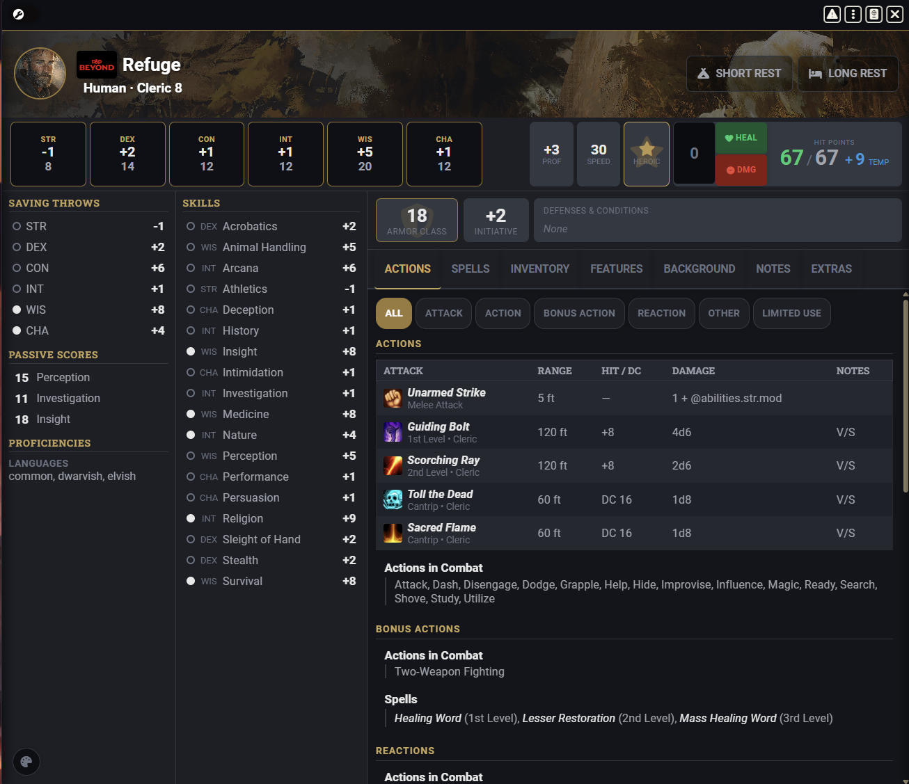
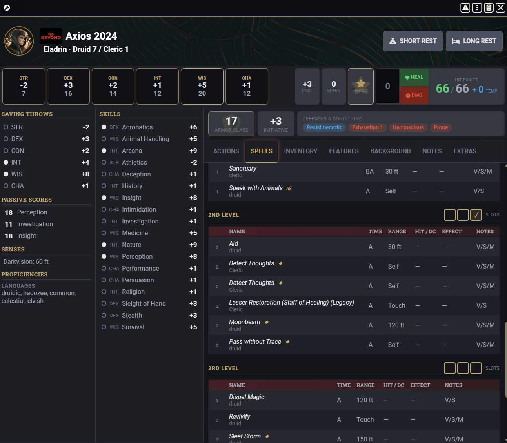
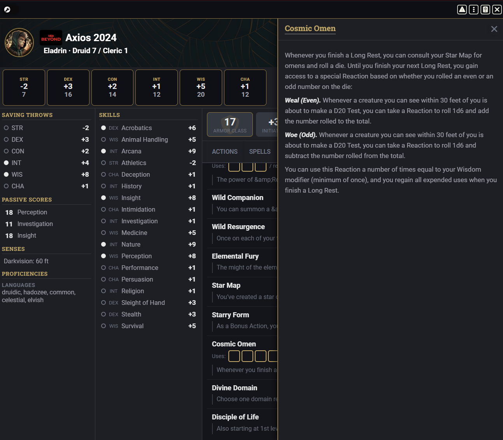
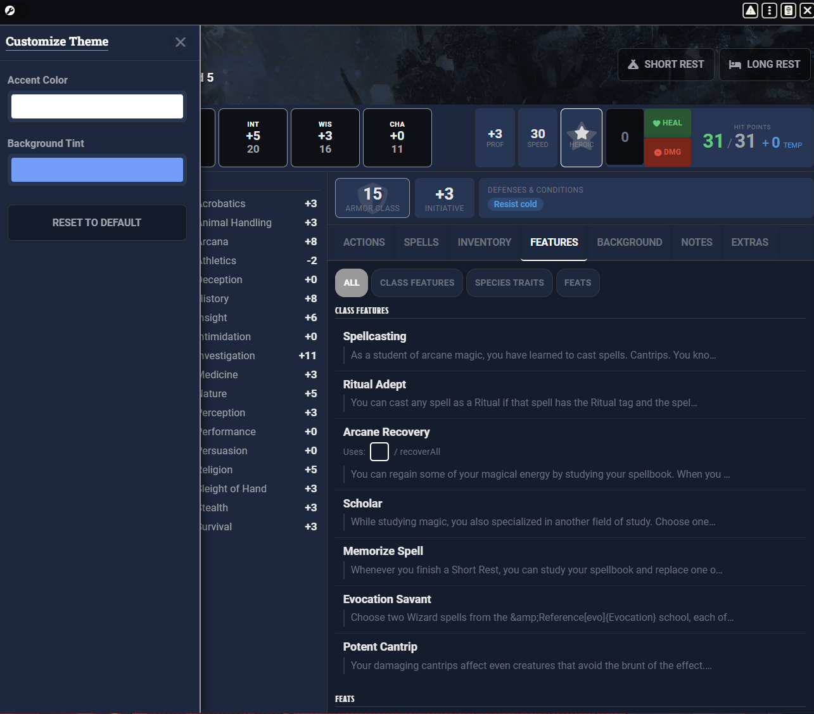

# Better Character Sheet

A **D&D Beyond–inspired** character sheet replacement for the [D&D 5th Edition](https://foundryvtt.com/packages/dnd5e) system in [Foundry VTT](https://foundryvtt.com/).



## Features

- **Dark theme** styled after D&D Beyond's character sheet UI
- **At-a-glance header** — portrait, name, species, class/level, rest buttons, and HP management all in one row
- **Ability scores & stats bar** — modifiers, proficiency bonus, speed, heroic inspiration, and a heal/damage HP widget
- **Full sidebar** — saving throws, passive scores, senses, and proficiencies always visible
- **Skills column** — all 18 skills with ability abbreviation, proficiency indicator, and total modifier
- **Tabbed content area** with seven tabs:
  - **Actions** — weapons and attack spells in one unified table, plus class features with use-tracking pips, filterable by action type
  - **Spells** — grouped by level with slot tracking pips, cast time, range, components, and concentration/ritual indicators
  - **Inventory** — grouped by type (weapons, equipment, consumables, etc.) with weight, cost, and equip/attune status
  - **Features** — class features, feats, and species traits with expandable full descriptions
  - **Background** — character backstory and background details
  - **Notes** — freeform notes
  - **Extras** — defenses, resistances, immunities, and conditions
- **Defenses & Conditions** — inline status display (resistances, exhaustion, conditions) below AC/Initiative
- **Custom theming** — per-character accent color and background tint via a built-in theme editor
- **D&D Beyond backdrop images** — automatically pulls your character's backdrop art from D&D Beyond when using [ddb-importer](https://github.com/MrPrimate/ddb-importer)

| Spells Tab | Feature Detail | Custom Theme |
|:---:|:---:|:---:|
|  |  |  |

## Requirements

| Dependency | Version |
|---|---|
| Foundry VTT | v14+ |
| D&D 5e System | 5.0.0+ (verified 5.3.2) |

### Optional

- [ddb-importer](https://github.com/MrPrimate/ddb-importer) — enables automatic D&D Beyond backdrop images on the character header

## Installation

### From Manifest URL (Recommended)

1. In Foundry VTT, go to **Settings → Manage Modules → Install Module**
2. Paste the manifest URL:
   ```
   https://github.com/porschiey-alt/better-character-sheet/releases/latest/download/module.json
   ```
3. Click **Install**

### Manual

1. Download the latest `module.zip` from [Releases](https://github.com/porschiey-alt/better-character-sheet/releases)
2. Extract to your Foundry `Data/modules/` directory
3. Enable the module in your world's module settings

## Usage

Once enabled, **Better Character Sheet** registers as the default character sheet. Open any PC actor and it will use the new sheet automatically.

### D&D Beyond Backdrop Images

If you use **ddb-importer**, backdrop images are captured automatically:

1. Import (or re-import) your character through ddb-importer
2. The module hooks into the import process and saves the backdrop URL
3. The backdrop appears in the character sheet header on the next render

No API keys or manual configuration needed — it piggybacks on ddb-importer's existing connection.

## Development

```bash
# Install dependencies
npm install

# Build (compiles TypeScript + SCSS → dist/)
npm run build

# Watch mode (rebuilds on file changes)
npm run watch

# Clean dist/
npm run clean
```

### Project Structure

```
src/
├── module.ts                  # Entry point — registers sheet & hooks
├── helpers/
│   └── ddb-backdrop.ts        # DnD Beyond backdrop image integration
├── sheets/
│   └── BetterCharacterSheet.ts # Sheet class extending dnd5e CharacterActorSheet
└── styles/
    └── better-character-sheet.scss
templates/
├── character-sheet.hbs        # Main sheet layout
├── parts/                     # Header, sidebar, skills, stats partials
└── tabs/                      # Actions, spells, inventory, features, etc.
```

## License

This project is provided as-is for use with Foundry VTT.
